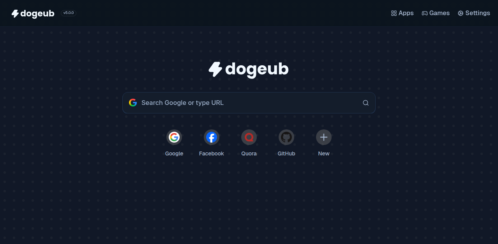

<div align="center">
  
  
  <br />

  <a href="https://buymeacoffee.com/dogubdev" target="_blank"></a> 


  <hr />
  DogeUB (Doge Unblocker) version 5 is finally here!

  
  <br />
  <br />

  


</div>

## Overview

DogeUB is a modern web proxy frontend and internet browsing hub, allowing you to browse the web anonymously while providing a full suite of apps and games, built with [React](https://github.com/facebook/react).

> [!IMPORTANT]
> Please consider starring our repository if you are forking it!

### Features:

- **Performance:** Fast, lightweight, and highly responsive.
- **Tabs:** Browse multiple sites with ease, providing an experience similar to a web browser!
- **Customization:** Multiple themes, extensive settings, and user-tailored experience.

---

## Development & Building


### Production:
```bash
git clone "repo name"
cd "repo name"
npm i
npm run build
node server.js
````

### Development:

```bash
git clone "repo name"
cd "repo name"
npm i
npm run dev
```

---


## Contributors / Developers

| Name          | Role               | GitHub |
| ------------- | ------------------ | ------ |
| Derpman | Lead Developer     |      [@stellarcase](https://github.com/stellarcase) |
| Fowntain | Lead Developer | [@fowntain](https://github.com/fowntain)     |
| Akane | Contributor | [@genericness](https://github.com/genericness)     |


> [!NOTE]
> Want to be on this list? Make a pull request!

---

### Made possible thanks to:

* [MercuryWorkshop/wisp-server-node](https://github.com/MercuryWorkshop/wisp-server-node)
* [MercuryWorkshop/scramjet](https://github.com/MercuryWorkshop/scramjet)
* [titaniumnetwork-dev/Ultraviolet](https://github.com/titaniumnetwork-dev/Ultraviolet)
* [lucide-icons/lucide](https://github.com/lucide-icons/lucide)

## License

This project is licensed under the **Genuerro Afro V3 License**.  
See the [LICENSE](LICENSE) file for more details.
